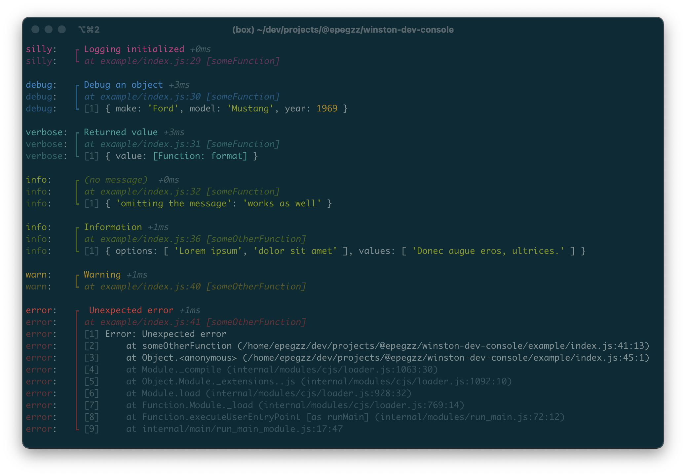
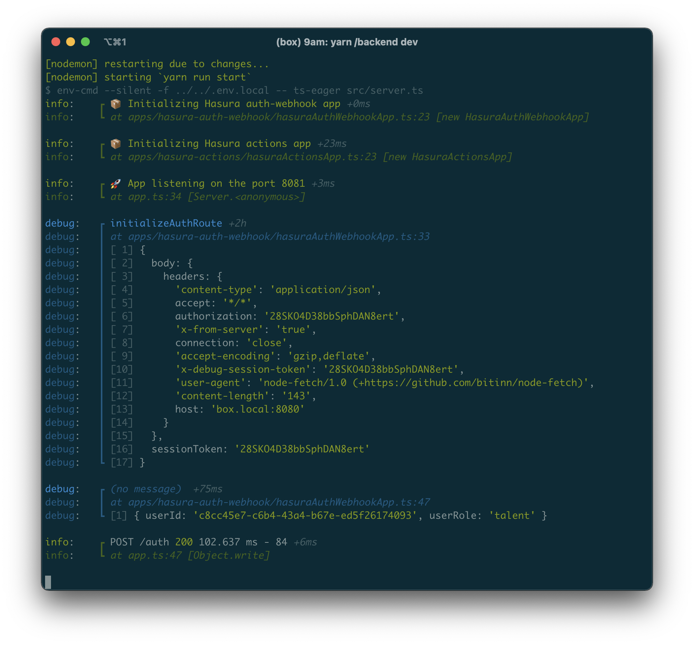

# winston-dev-console

A Winston@3 console format for development (based on [winston-console-format](https://github.com/duccio/winston-console-format)) that aims to improve NodeJS development UX by
* adding the source of the logging statement to the log output
* optimizing readability of each log statement through log statement separation, output colorization and arg pretty printing
   

## Demo



### Real world screenshot:



## Install

```bash
npm install winston @epegzz/winston-dev-console
```

or

```bash
yarn add winston @epegzz/winston-dev-console
```
<br>

## Usage TypeScript

```typescript
import { createLogger, format, transports, config } from "winston";
import winstonDevConsole from "@epegzz/winston-dev-console";
import util from "util";

let log = createLogger({
  levels: config.syslog.levels,
  level: "debug", // or use process.env.LOG_LEVEL
});

// Note: You probably only want to use winstonDevConsole during development
log = winstonDevConsole.init(log);
log.add(
  winstonDevConsole.transport({
    showTimestamps: false,
    addLineSeparation: true,
    logLevels: config.syslog.levels
  })
);

log.info("Logging initialized");
log.debug("Debug an object", { make: "Ford", model: "Mustang", year: 1969 });
log.notice("Returned value", { value: util.format });
log.alert("Information", {
  options: ["Lorem ipsum", "dolor sit amet"],
  values: ["Donec augue eros, ultrices."],
});
log.warn("Warning");
log.emerg(new Error("Unexpected error"));
```

## Usage JavaScript

```js
const { createLogger, format, transports, config } = require("winston");
const winstonDevConsole = require("@epegzz/winston-dev-console").default;
const util = require("util");

let log = createLogger({
  levels: config.syslog.levels,
  level: "debug", // or use process.env.LOG_LEVEL
});

// Note: You probably only want to use winstonDevConsole during development
log = winstonDevConsole.init(log);
log.add(
  winstonDevConsole.transport({
    showTimestamps: false,
    addLineSeparation: true,
    logLevels: config.cli.levels,
  })
);

log.silly("Logging initialized");
log.prompt("Debug an object", { make: "Ford", model: "Mustang", year: 1969 });
log.verbose("Returned value", { value: util.format });
log.info("Information", {
  options: ["Lorem ipsum", "dolor sit amet"],
  values: ["Donec augue eros, ultrices."],
});
log.warn("Warning");
log.emerg(new Error("Unexpected error"));
```

# Usage Tables

```js
let tableLog = createLogger({
  level: "debug", // or use process.env.LOG_LEVEL
  levels: config.syslog.levels
});

// Note: You probably only want to use winstonDevConsole during development
tableLog = winstonDevConsole.init(tableLog);
tableLog.add(
  winstonDevConsole.transport({
    showTimestamps: true,
    addLineSeparation: true,
    logLevels: config.syslog.levels,
    table: true
  })
);

// The first item of the array is reserved for the Table constructor argument which takes in an options object
// {}, [], '', or null can be used to forego a header/formatting
tableLog.info("Horizontal Table", [
    {head: ['TH 1 label', 'TH 2 label'], colWidths: [25, 25]},
    ['First value', 'Second value'],
    ['First value', 'Second value']
]);
tableLog.notice("Vertical Table", [
    {},
    { 'Some key': 'Some value' },
    { 'Another key': 'Another value' }
]);
tableLog.debug("Cross Table", [
    { head: [ '', 'Top Header 1', 'Top Header 2' ] },
    { 'Left Header 1': [ 'Value Row 1 Col 1', 'Value Row 1 Col 2' ] },
    { 'Left Header 2': [ 'Value Row 2 Col 1', 'Value Row 2 Col 2' ] }
]);
```

#

## API

## winstonDevConsole.format(options)

### options

Configuration object.<br><br>Type: `DevConsoleFormatOptions`

### options.inspectOptions

`util.inspect()` [configuration object](https://nodejs.org/api/util.html#util_util_inspect_object_options).<br><br> Type: `Object`<br> 

### options.basePath

Used to remove the base path of the project when showing the file path of the log statement.
By default anything in the path before (and including) the `src` folder will be removed.
<br><br>
Type: `String`<br>

### options.addLineSeparation

Wheather or not to separate each log statement with a blank line.
<br><br>
Type: `Boolean`<br>
Default: `true`<br>

### options.showTimestamps

Wheather or not to show timestamps<br>
During development the timestamps are usually more noise then helpful, therefore disabled by default.
<br><br>
Type: `Boolean`<br>
Default: `false`<br>

### options.logLevels

Used to select the log level severity schema from the three options provided by triple-beam: npm, syslog, and cli<br>
By default this is set to npm log levels
<br><br>
Type: `{[k: string]: number}`<br>
Default: `winston.config.npm.levels`<br>

## options.showMeta

Wheather or not to show meta after the message, callee path, and optional timestamp
<br><br>
Type: `boolean`<br>
Default: `true`<br>

## options.table

Wheather or not the meta lines after the message is outputted as a table rather than a string literal of an object<br>
Use only when the output is expected to always be tablature. A second logger may be required for tables and non tables
<br><br>
Type: `boolean`
Default: `false`

## Acknowledgements

This project is inspired by and partly shamelessly copied from [winston-console-format](https://github.com/duccio/winston-console-format)